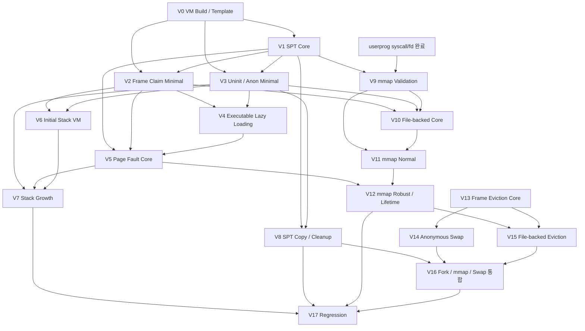
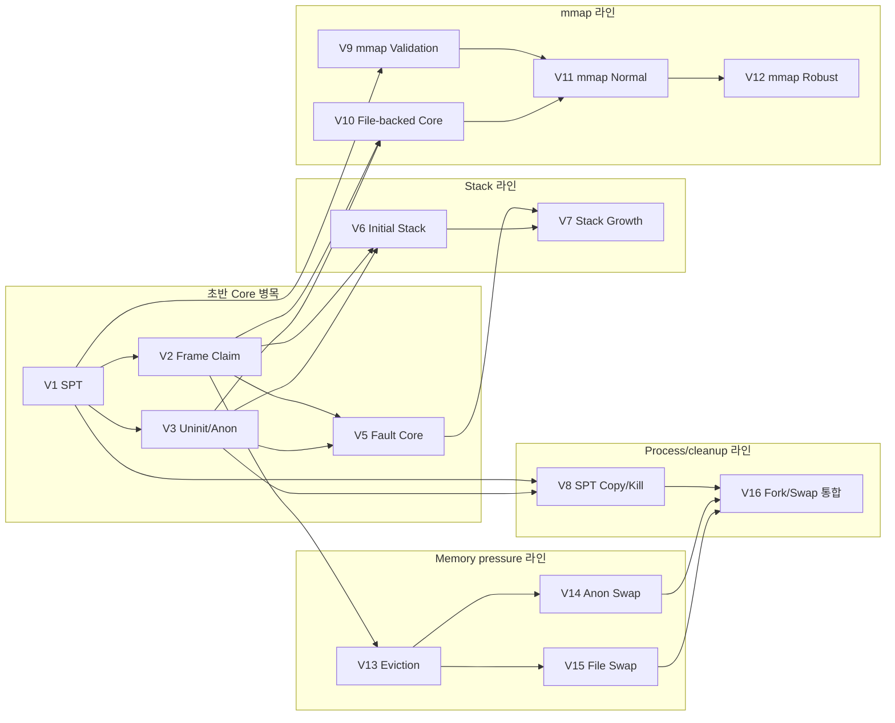
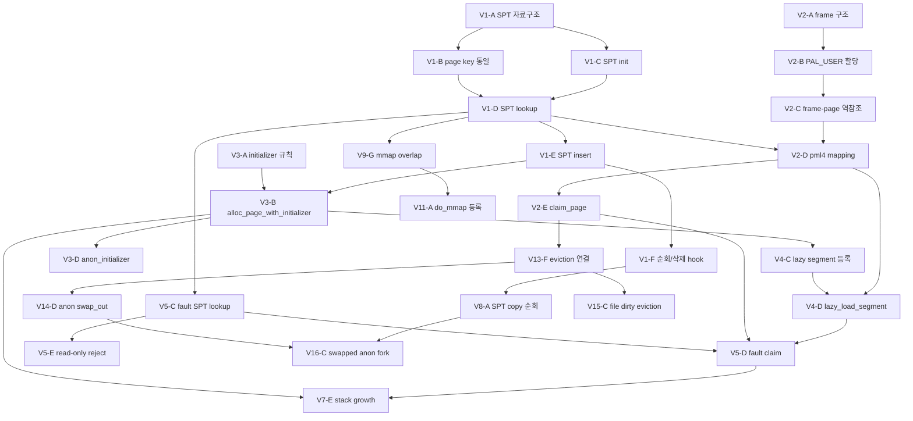

# Pintos VM 티켓 분해와 의존성

이 문서는 Pintos Project 3 `vm`을 여러 팀원이 각자 속도에 맞춰 나누어 진행할 수 있도록 작업 단위를 티켓 수준으로 쪼갠 것이다.

`V0`, `V1` 같은 항목은 에픽 또는 작업 묶음이고, 실제 티켓으로 등록할 단위는 `V0-A`, `V0-B` 같은 행이다. Copy-on-write는 이번 분해 범위에서 제외한다.

구현 코드나 붙여 넣을 수 있는 구현안은 포함하지 않는다. 기준은 로컬 reference와 로컬 테스트 파일이다.

## 기준 자료

- `docs/reference/pintos-kaist-original/3_project3/0_introduction.md`
- `docs/reference/pintos-kaist-original/3_project3/1_vm_management.md`
- `docs/reference/pintos-kaist-original/3_project3/2_anon.md`
- `docs/reference/pintos-kaist-original/3_project3/3_stack_growth.md`
- `docs/reference/pintos-kaist-original/3_project3/4_memory_mapped_files.md`
- `docs/reference/pintos-kaist-original/3_project3/5_swapping.md`
- `docs/reference/pintos-kaist-kr/3_project3/*`
- `pintos/tests/vm/Make.tests`
- `pintos/tests/vm/Rubric.functionality`
- `pintos/tests/vm/Rubric.robustness`

제외 범위:

- `docs/reference/pintos-kaist-original/3_project3/6_cow.md`
- `pintos/tests/vm/cow/*`

## 기존 userprog 분해 방식 분석

복붙된 userprog 예시는 기능을 단순히 syscall 이름별로 나누지 않았다. 실제로는 다음 기준으로 나뉘었다.

1. 최소 실행 흐름을 먼저 만든다.
   - B0-B2는 `initd/wait`, syscall entry, `write(1)`, `exit`, argument passing을 묶어 유저 프로그램이 실행되고 출력하고 종료되는 최소 루프를 만든다.
   - 이 단계는 단독 PASS보다 이후 테스트의 기반에 가깝다.

2. 정상 경로와 예외 경로를 분리한다.
   - file syscall은 fd table core, normal syscall, invalid/boundary 처리로 나뉜다.
   - 정상 동작을 먼저 만든 뒤 bad pointer, bad fd, boundary 같은 방어 처리를 별도 티켓 묶음으로 둔다.

3. 공통 자료구조를 먼저 만들고, 그 위에 기능을 얹는다.
   - fd table이 B5에 먼저 있고, create/open/close/read/write는 그 뒤에 온다.
   - process lifecycle도 child status 구조, wait, exec, fork, fd 상속이 순서대로 쌓인다.

4. 통합 테스트성 작업은 뒤로 보낸다.
   - multi-recurse, multi-child-fd, multi-oom, rox, dup2처럼 여러 하위 시스템이 함께 걸리는 항목은 후반부에 배치한다.

5. 큰 기능 안에서도 A/B/C 티켓으로 잘게 쪼갠다.
   - 예를 들어 B2 argument passing도 command line 보존, 파일명 분리, tokenizing, stack push, alignment, register 세팅으로 나뉜다.
   - VM도 같은 방식으로 `SPT`, `frame`, `fault`, `lazy`, `mmap`, `swap`을 더 작은 실제 티켓으로 쪼개야 한다.

## VM 분해 원칙

VM은 `struct page`, supplemental page table, frame table, page fault handler가 서로 강하게 얽힌다. 따라서 너무 큰 티켓은 병목이 되고, 너무 작은 티켓은 충돌이 된다.

이 문서의 기준은 다음과 같다.

- 실제 티켓은 `V0-A`처럼 0.5일~1일 단위로 잡을 수 있게 쪼갠다.
- 테스트 PASS가 바로 나오지 않는 기반 티켓도 허용한다.
- 공통 contract를 만드는 티켓은 선행 의존성으로 명확히 둔다.
- 같은 파일을 깊게 동시에 고치는 작업은 선행/후행 관계를 둔다.
- 정상 경로와 robustness/boundary 경로를 분리한다.
- COW는 제외한다.

## 전체 흐름

큰 순서는 다음과 같다.

```text
V0 VM template 확인
  -> V1 SPT core
  -> V2 frame claim
  -> V3 uninit/anon minimal
  -> V4 executable lazy loading
  -> V5 page fault core
  -> V6 initial stack VM 전환
  -> V7 stack growth
  -> V8 SPT copy/kill
  -> V9 mmap validation
  -> V10 file-backed core
  -> V11 mmap normal
  -> V12 mmap robustness/lifetime
  -> V13 frame eviction
  -> V14 anonymous swap
  -> V15 file-backed eviction
  -> V16 fork/swap/mmap 통합
  -> V17 regression 정리
```

병렬로 보면 초반 병목은 `V1`, `V2`, `V5`다. 이 셋이 열려야 대부분의 VM 기능이 붙는다. 이후에는 stack, mmap validation, file-backed page, cleanup을 나누어 진행할 수 있다.

## 의존성 그래프

아래 그래프는 Mermaid 문법으로 작성했다. Mermaid를 지원하는 Markdown 뷰어에서는 바로 시각화된다.

### 에픽 수준 의존성



### 병렬 작업 레인



### 실제 티켓 흐름 예시

이 그래프는 모든 세부 티켓을 다 넣기보다는, 빠른 팀원이 다음 티켓을 잡을 때 막히기 쉬운 핵심 경로만 표시한다.



## 티켓 목록

### V0. VM Build / Template 연결

| ID | 세부 작업 | 비중 | 선행 |
|---|---|---:|---|
| V0-A | VM 빌드 플래그와 `Make.vars` 흐름 확인 | 20% | 없음 |
| V0-B | `vm_init()` 호출 흐름 확인 | 20% | V0-A |
| V0-C | thread/process에서 SPT 생명주기 위치 확인 | 25% | V0-B |
| V0-D | `page`, `frame`, `uninit`, `anon`, `file` 구조 책임 분리 | 25% | V0-B |
| V0-E | `inspect` 관련 파일 변경 금지 범위 확인 | 10% | V0-D |

완료 후 단독 PASS보다는 이후 VM 작업의 공통 기준이 된다.

### V1. Supplemental Page Table Core

| ID | 세부 작업 | 비중 | 선행 |
|---|---|---:|---|
| V1-A | SPT 자료구조 결정 | 20% | V0-D |
| V1-B | page key를 page-aligned `va`로 통일 | 15% | V1-A |
| V1-C | `supplemental_page_table_init()` 구현 | 15% | V1-A |
| V1-D | `spt_find_page()` 구현 | 20% | V1-B, V1-C |
| V1-E | `spt_insert_page()` 중복 검사 구현 | 20% | V1-D |
| V1-F | SPT entry 삭제/순회에 필요한 hook 정리 | 10% | V1-E |

완료 후 lazy loading, fault handling, mmap overlap 검사의 기반이 된다.

### V2. Frame Claim Minimal

| ID | 세부 작업 | 비중 | 선행 |
|---|---|---:|---|
| V2-A | frame 구조 확장 필요 항목 결정 | 20% | V0-D |
| V2-B | `vm_get_frame()`에서 `PAL_USER` 할당 연결 | 25% | V2-A |
| V2-C | frame-page 역참조 연결 | 15% | V2-B |
| V2-D | `vm_do_claim_page()`에서 pml4 mapping 연결 | 25% | V1-D, V2-C |
| V2-E | `vm_claim_page()`에서 SPT lookup 연결 | 15% | V1-D, V2-D |

완료 후 아직 eviction은 없어도 claim 가능한 상태가 된다.

### V3. Uninit / Anon Page Minimal

| ID | 세부 작업 | 비중 | 선행 |
|---|---|---:|---|
| V3-A | `VM_TYPE`과 initializer 선택 규칙 확인 | 15% | V0-D |
| V3-B | `vm_alloc_page_with_initializer()` 연결 | 30% | V1-E, V3-A |
| V3-C | `uninit_new` aux 보존 흐름 확인 | 15% | V3-B |
| V3-D | `anon_initializer()` operations 연결 | 20% | V3-B |
| V3-E | anon page 기본 상태 초기화 | 10% | V3-D |
| V3-F | `uninit_destroy()` / `anon_destroy()` 최소 처리 | 10% | V3-C, V3-D |

완료 후 lazy anon/file 등록의 기반이 된다.

### V4. Executable Lazy Loading

| ID | 세부 작업 | 비중 | 선행 |
|---|---|---:|---|
| V4-A | `load_segment` 기존 eager 흐름 분석 | 15% | V3-B |
| V4-B | segment aux 구조 설계 | 20% | V4-A |
| V4-C | `load_segment`를 page별 lazy 등록 방식으로 전환 | 25% | V4-B |
| V4-D | `lazy_load_segment` file read/zero 처리 | 25% | V4-C, V2-D |
| V4-E | aux lifetime/free 정책 정리 | 10% | V4-D |
| V4-F | writable flag 보존 확인 | 5% | V4-C |

완료 후 목표 기반은 `lazy-anon`, `lazy-file` 일부, `page-*` 계열 기반이다.

### V5. Page Fault Core

| ID | 세부 작업 | 비중 | 선행 |
|---|---|---:|---|
| V5-A | `page_fault()`에서 `vm_try_handle_fault()`까지 흐름 확인 | 15% | V2-E |
| V5-B | kernel/user address reject 기준 정리 | 15% | V5-A |
| V5-C | not-present fault에서 SPT lookup 연결 | 20% | V1-D, V5-A |
| V5-D | lazy/uninit page claim 연결 | 25% | V2-E, V4-D, V5-C |
| V5-E | write to read-only page reject 처리 | 15% | V5-C |
| V5-F | invalid fault 종료 정책 연결 | 10% | V5-B, V5-E |

완료 후 목표 PASS 후보는 `lazy-anon`, `lazy-file`, `pt-bad-addr`, `pt-write-code` 계열 일부다.

### V6. Initial Stack VM 전환

| ID | 세부 작업 | 비중 | 선행 |
|---|---|---:|---|
| V6-A | `setup_stack` 기존 방식 분석 | 20% | V3-D |
| V6-B | 첫 stack page를 `VM_ANON`으로 등록 | 25% | V3-B |
| V6-C | 첫 stack page 즉시 claim | 25% | V2-E, V6-B |
| V6-D | argument passing 기존 로직과 충돌 확인 | 20% | V6-C |
| V6-E | stack marker/식별 정책 정리 | 10% | V6-D |

완료 후 Project 2 userprog 회귀의 기반이 된다.

### V7. Stack Growth

| ID | 세부 작업 | 비중 | 선행 |
|---|---|---:|---|
| V7-A | user `rsp` 저장/획득 위치 정리 | 20% | V5-A |
| V7-B | `rsp` 기준 stack 접근 heuristic 정의 | 20% | V7-A |
| V7-C | `USER_STACK` 기준 1MB limit 검사 | 15% | V7-B |
| V7-D | fault address round-down 처리 | 10% | V7-B |
| V7-E | `vm_stack_growth()`에서 anon page 추가 | 25% | V3-B, V7-C |
| V7-F | invalid growth는 종료 처리 | 10% | V5-F, V7-E |

완료 후 목표 PASS는 `pt-grow-stack`, `pt-grow-stk-sc`, `pt-big-stk-obj`, `pt-grow-bad`다.

### V8. SPT Copy / Process Exit Cleanup

| ID | 세부 작업 | 비중 | 선행 |
|---|---|---:|---|
| V8-A | `supplemental_page_table_copy()` 순회 정책 | 20% | V1-F |
| V8-B | uninit page copy 정책 | 20% | V3-B, V8-A |
| V8-C | claimed anon page copy 정책 | 25% | V2-D, V8-A |
| V8-D | `supplemental_page_table_kill()` 구현 | 15% | V3-F, V8-A |
| V8-E | `process_exit()`에서 SPT cleanup 연결 | 10% | V8-D |
| V8-F | fork 실패 시 cleanup 경로 확인 | 10% | V8-B, V8-C |

완료 후 목표 PASS 후보는 `page-parallel`, `page-merge-seq` 일부다.

### V9. mmap Syscall Entry / Validation

| ID | 세부 작업 | 비중 | 선행 |
|---|---|---:|---|
| V9-A | `mmap` / `munmap` syscall 번호 연결 | 15% | userprog syscall 완료 |
| V9-B | fd lookup/file object 접근 경로 확인 | 15% | userprog fd 완료 |
| V9-C | `addr == NULL` 및 page-aligned 검사 | 15% | V9-A |
| V9-D | `length == 0` 검사 | 10% | V9-A |
| V9-E | fd 0/1 및 bad fd reject | 15% | V9-B |
| V9-F | offset page-aligned 검사 | 10% | V9-A |
| V9-G | mapping range overlap 검사 | 20% | V1-D, V9-C |

완료 후 목표 PASS는 `mmap-null`, `mmap-zero-len`, `mmap-misalign`, `mmap-bad-fd*`, `mmap-bad-off` 일부다.

### V10. File-backed Page Core

| ID | 세부 작업 | 비중 | 선행 |
|---|---|---:|---|
| V10-A | `file_page` metadata 설계 | 20% | V9-B |
| V10-B | `file_reopen` 정책 적용 | 15% | V10-A |
| V10-C | `file_backed_initializer()` operations 연결 | 20% | V3-B, V10-A |
| V10-D | file-backed lazy aux 구성 | 20% | V10-C |
| V10-E | `file_backed_swap_in()` read/zero 처리 | 25% | V10-D, V2-D |

완료 후 `mmap-read`, `lazy-file`의 기반이 된다.

### V11. mmap Normal / munmap Normal

| ID | 세부 작업 | 비중 | 선행 |
|---|---|---:|---|
| V11-A | `do_mmap()`에서 page별 `VM_FILE` 등록 | 25% | V9-G, V10-D |
| V11-B | partial final page zero 처리 | 15% | V11-A |
| V11-C | mmap 성공 return address 정책 | 10% | V11-A |
| V11-D | `do_munmap()` range 식별 | 15% | V11-A |
| V11-E | dirty page write-back | 25% | V10-E, V11-D |
| V11-F | munmap 후 SPT entry 제거와 자원 정리 | 10% | V11-E |

완료 후 목표 PASS는 `mmap-read`, `mmap-write`, `mmap-unmap`, `mmap-close`다.

### V12. mmap Robust / File Lifetime

| ID | 세부 작업 | 비중 | 선행 |
|---|---|---:|---|
| V12-A | code segment overlap reject | 15% | V9-G, V11-A |
| V12-B | data segment overlap reject | 15% | V9-G, V11-A |
| V12-C | stack overlap reject | 15% | V7-E, V9-G |
| V12-D | close 후 mapping 유지 확인 | 15% | V10-B, V11-E |
| V12-E | remove 후 mapping 유지 확인 | 15% | V10-B, V11-E |
| V12-F | process exit 시 implicit munmap | 15% | V8-E, V11-F |
| V12-G | read-only mmap write fault 처리 | 10% | V5-E, V11-A |

완료 후 목표 PASS는 `mmap-over-code`, `mmap-over-data`, `mmap-over-stk`, `mmap-clean`, `mmap-remove`, `mmap-ro`, `mmap-exit`다.

### V13. Frame Table / Eviction Core

| ID | 세부 작업 | 비중 | 선행 |
|---|---|---:|---|
| V13-A | 전역 frame table 구조 설계 | 20% | V2-A |
| V13-B | frame table insert/remove | 15% | V2-B |
| V13-C | eviction victim 선택 정책 | 20% | V13-A |
| V13-D | accessed bit 기반 second chance 처리 | 15% | V13-C |
| V13-E | victim pml4 mapping 제거 | 15% | V13-C |
| V13-F | `vm_get_frame()` 실패 시 eviction 연결 | 15% | V13-E |

완료 후 swap 구현의 선행 조건이 된다.

### V14. Anonymous Swap

| ID | 세부 작업 | 비중 | 선행 |
|---|---|---:|---|
| V14-A | swap disk 초기화 | 15% | V13-F |
| V14-B | swap bitmap/free slot 관리 | 20% | V14-A |
| V14-C | `anon_page`에 swap slot 상태 추가 | 15% | V3-D, V14-B |
| V14-D | `anon_swap_out()` page write | 25% | V13-F, V14-C |
| V14-E | `anon_swap_in()` page read/free slot | 20% | V14-D |
| V14-F | process exit 시 swap slot 회수 | 5% | V8-D, V14-E |

완료 후 목표 PASS는 `swap-anon`, `swap-iter` 일부다.

### V15. File-backed Eviction / Swap

| ID | 세부 작업 | 비중 | 선행 |
|---|---|---:|---|
| V15-A | file-backed dirty 판단 | 20% | V11-E, V13-F |
| V15-B | clean file page eviction | 20% | V15-A |
| V15-C | dirty file page write-back eviction | 25% | V15-A |
| V15-D | `file_backed_swap_in()` 재진입 처리 | 20% | V10-E, V15-B |
| V15-E | dirty/accessed bit reset 정책 | 15% | V15-C |

완료 후 목표 PASS는 `swap-file`, `mmap-shuffle`, `swap-iter`다.

### V16. VM Fork / mmap Inherit / Swap Fork 통합

| ID | 세부 작업 | 비중 | 선행 |
|---|---|---:|---|
| V16-A | fork 시 mmap/file-backed page copy 정책 | 20% | V8-A, V11-A |
| V16-B | `mmap-inherit` child mapping 동작 | 20% | V16-A |
| V16-C | swapped anon page fork 처리 | 20% | V14-E, V8-C |
| V16-D | swapped file page fork 처리 | 15% | V15-D, V16-A |
| V16-E | parent/child cleanup race 점검 | 15% | V8-F, V16-C |
| V16-F | low-memory fork 회귀 점검 | 10% | V13-F, V14-E, V15-D |

완료 후 목표 PASS는 `mmap-inherit`, `swap-fork`, `page-merge-par`, `page-merge-mm`, `page-merge-stk`다.

### V17. VM Regression / Boundary 정리

| ID | 세부 작업 | 비중 | 선행 |
|---|---|---:|---|
| V17-A | Project 2 전체 회귀 확인 항목 정리 | 15% | V6-E, V8-E |
| V17-B | `lazy-anon` / `lazy-file` 회귀 정리 | 15% | V4-D, V10-E |
| V17-C | stack growth 회귀 정리 | 15% | V7-F |
| V17-D | mmap 전체 회귀 정리 | 20% | V12-G |
| V17-E | swap 전체 회귀 정리 | 20% | V14-F, V15-E, V16-F |
| V17-F | leak/resource cleanup 점검 | 15% | V8-E, V11-F, V14-F |

완료 후 목표 PASS는 COW를 제외한 `tests/vm` 전체다.

## 핵심 의존성 요약

| 선행 | 열리는 작업 | 이유 |
|---|---|---|
| V1 SPT core | V2, V4, V5, V9, V11 | page lookup/insert가 모든 VM fault와 mapping의 기준이다. |
| V2 frame claim | V4, V5, V6, V10 | page를 실제 frame에 claim할 수 있어야 lazy load와 stack이 동작한다. |
| V3 uninit/anon minimal | V4, V6, V7, V8 | lazy page 등록과 anon stack/page cleanup의 기반이다. |
| V4 executable lazy loading | V5 | fault 발생 시 SPT entry를 실제 내용으로 채워야 한다. |
| V5 page fault core | V7, V12, swap 계열 | fault가 정상/비정상 접근을 구분해야 stack/mmap/swap이 붙는다. |
| V7 stack growth | V12-C | mmap이 stack 영역과 overlap되는지 판단해야 한다. |
| V8 SPT copy/kill | V16, V17 | fork와 process exit cleanup은 SPT copy/kill에 의존한다. |
| V9 mmap validation | V11, V12 | mmap 정상 등록 전에 invalid input과 overlap 기준이 필요하다. |
| V10 file-backed core | V11, V15 | file-backed page의 lazy load와 eviction이 같은 metadata를 쓴다. |
| V13 eviction core | V14, V15, V16 | swap은 frame 부족 상황에서 victim을 evict할 수 있어야 의미가 있다. |

## 병렬 진행 전략

### 초반 병목

초반에는 다음 티켓을 우선 배정한다.

- `V1-A`~`V1-F`: SPT core
- `V2-A`~`V2-E`: frame claim minimal
- `V3-A`~`V3-F`: uninit/anon minimal
- `V5-A`~`V5-F`: page fault core

이 네 묶음이 늦어지면 다른 팀원이 작업할 수 있는 범위가 문서 분석이나 테스트 분석으로 제한된다.

### 초반 병렬 가능 작업

구현 병목과 별개로 다음은 초반부터 병렬 진행이 가능하다.

| 작업 | 가능한 이유 | 주의 |
|---|---|---|
| V0 전체 | 코드 흐름 확인 작업이다. | V0 결과를 공통 contract로 공유해야 한다. |
| V4-A, V4-B | `load_segment` 분석과 aux 설계는 SPT 구현과 병렬 가능하다. | 최종 구현은 V3-B 이후가 안전하다. |
| V7-A, V7-B | stack heuristic 설계는 fault core와 병렬 가능하다. | 구현 연결은 V5 이후가 안전하다. |
| V9-A~V9-F | mmap syscall validation 일부는 file-backed 구현 전에 진행 가능하다. | overlap 검사는 V1 SPT가 필요하다. |
| V10-A, V10-B | file-backed metadata와 `file_reopen` 정책은 mmap normal 전에 설계 가능하다. | initializer 연결은 V3 이후가 안전하다. |

### 중반 병렬 가능 작업

V1-V5가 어느 정도 안정되면 다음을 나누어 잡는다.

| 라인 | 티켓 | 설명 |
|---|---|---|
| Stack 라인 | V6, V7 | initial stack 전환과 stack growth를 담당한다. |
| Lazy 라인 | V4, V5 | executable lazy load와 fault handling을 담당한다. |
| mmap 라인 | V9, V10, V11 | mmap validation, file-backed page, normal mmap/munmap을 담당한다. |
| Cleanup 라인 | V8 | SPT copy/kill과 process exit cleanup을 담당한다. |

### 후반 병렬 가능 작업

후반에는 memory pressure와 file-backed behavior가 함께 걸린다.

| 라인 | 티켓 | 설명 |
|---|---|---|
| Eviction 라인 | V13 | frame table과 victim 선택을 담당한다. |
| Anon swap 라인 | V14 | swap disk/table과 anonymous swap을 담당한다. |
| File swap 라인 | V15 | file-backed page eviction/write-back을 담당한다. |
| Fork 통합 라인 | V16 | SPT copy, swapped page, mmap inherit를 통합한다. |
| Regression 라인 | V17 | COW 제외 전체 VM 회귀와 cleanup 체크리스트를 담당한다. |

## 작업 속도 차이를 고려한 티켓 큐

빠른 팀원이 다음 작업을 잡을 수 있도록, 선행 조건별 큐를 나눈다.

### 선행 거의 없는 티켓

- V0-A
- V0-B
- V0-D
- V1-A
- V2-A
- V3-A
- V4-A
- V5-A
- V7-A
- V9-A
- V9-C
- V9-D
- V9-F

### SPT가 끝나면 열리는 티켓

- V1-F
- V2-D
- V2-E
- V4-C
- V5-C
- V9-G
- V8-A

### Frame claim이 끝나면 열리는 티켓

- V4-D
- V5-D
- V6-C
- V10-E

### Fault core가 끝나면 열리는 티켓

- V7-F
- V12-G
- swap-in fault path 점검

### mmap normal이 끝나면 열리는 티켓

- V12-A
- V12-B
- V12-C
- V12-D
- V12-E
- V12-F
- V15-A

### Eviction core가 끝나면 열리는 티켓

- V14-A
- V14-D
- V15-A
- V15-B
- V15-C
- V16-F

## 테스트 목표 묶음

테스트는 직접 실행하지 않고, 어떤 티켓이 어떤 테스트와 연결되는지만 정리한다.

| 테스트 묶음 | 관련 티켓 |
|---|---|
| `lazy-anon`, `lazy-file` | V3, V4, V5, V10 |
| `pt-grow-stack`, `pt-grow-stk-sc`, `pt-big-stk-obj`, `pt-grow-bad` | V6, V7 |
| `pt-bad-addr`, `pt-bad-read`, `pt-write-code`, `pt-write-code2` | V5, V12-G |
| `page-linear`, `page-shuffle` | V1, V2, V3, V4, V5 |
| `page-parallel`, `page-merge-seq`, `page-merge-par`, `page-merge-mm`, `page-merge-stk` | V8, V13, V16 |
| `mmap-read`, `mmap-write`, `mmap-unmap`, `mmap-close` | V9, V10, V11 |
| `mmap-null`, `mmap-zero-len`, `mmap-misalign`, `mmap-bad-fd*`, `mmap-bad-off`, `mmap-kernel` | V9, V12 |
| `mmap-over-code`, `mmap-over-data`, `mmap-over-stk`, `mmap-overlap` | V9-G, V12 |
| `mmap-clean`, `mmap-remove`, `mmap-ro`, `mmap-exit`, `mmap-inherit` | V11, V12, V16 |
| `swap-anon`, `swap-iter` | V13, V14 |
| `swap-file` | V13, V15 |
| `swap-fork` | V13, V14, V15, V16 |

## 최종 정리

VM은 큰 기능 단위로만 나누면 초반 병목이 심하다. 실제 티켓은 `Vx-A` 단위로 등록하고, `Vx`는 에픽으로 둔다.

가장 먼저 끝나야 하는 것은 SPT, frame claim, uninit/anon minimal, page fault core다. 이 기반이 열린 뒤에는 stack, mmap, cleanup을 병렬로 나누고, 후반에는 eviction, anonymous swap, file-backed swap, fork 통합을 나누어 진행한다.

COW는 이번 계획에서 제외한다.
