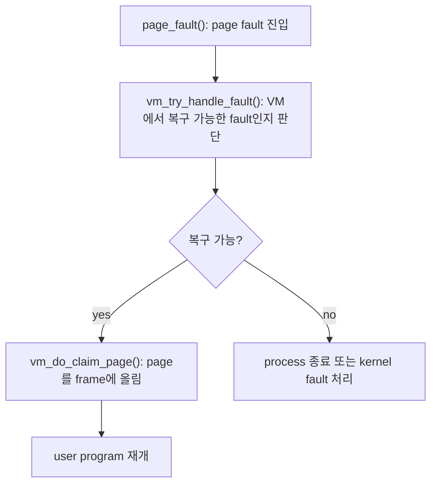
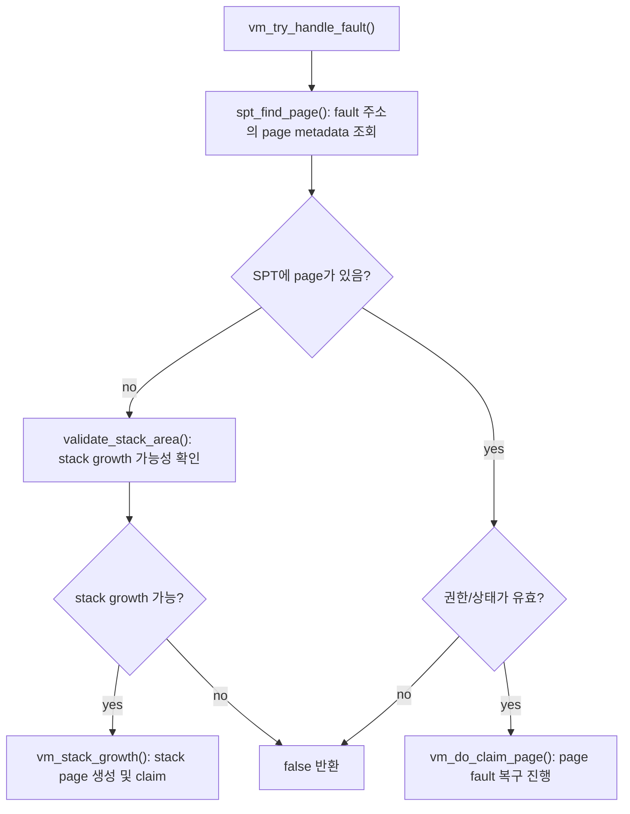
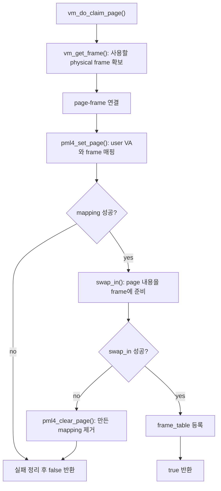
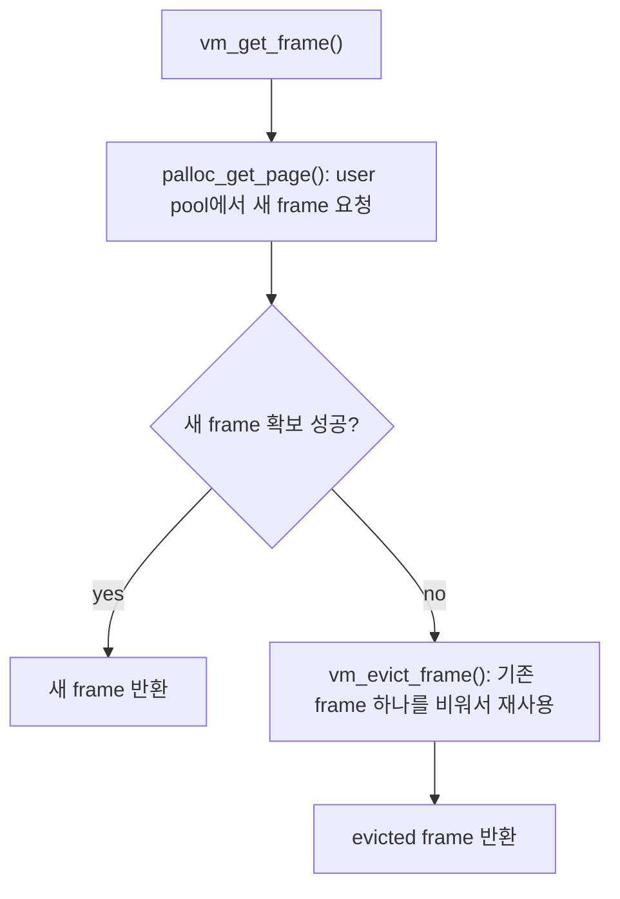
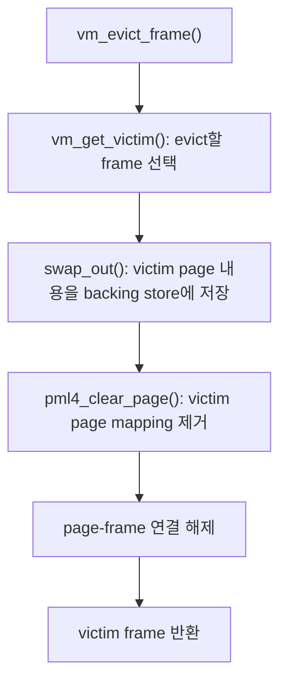
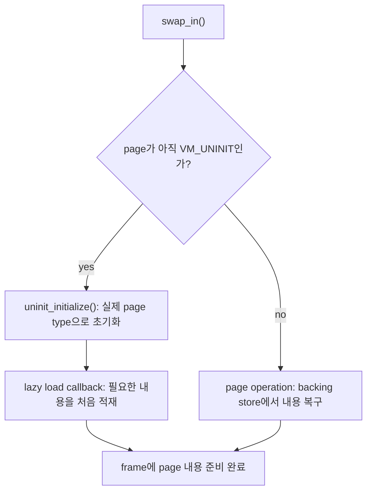
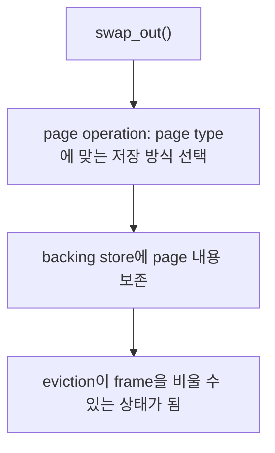
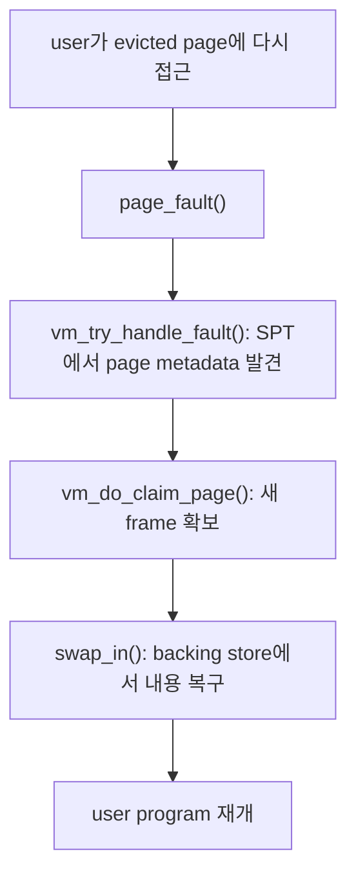
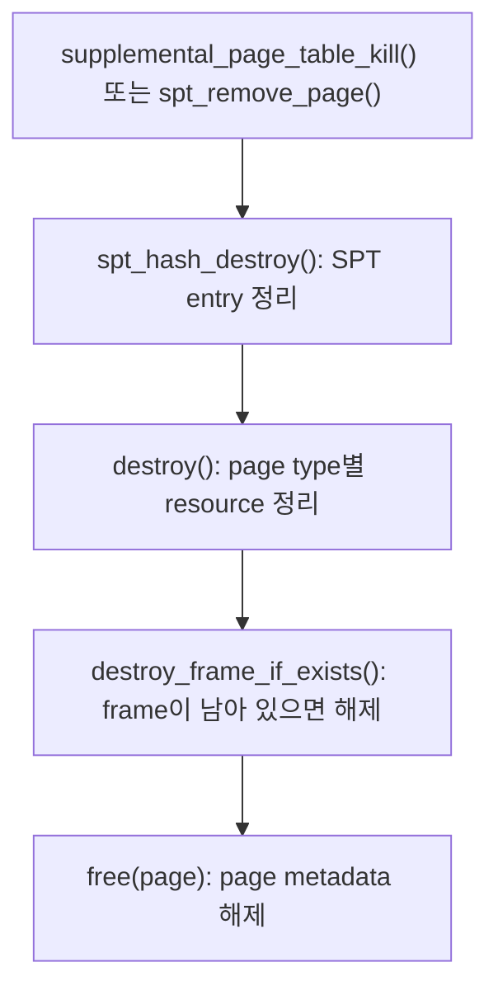

# 페이징이 이루어지는 과정

swap in은 “page 내용을 새 physical frame으로 가져오는 작업”
swap out은 “현재 physical frame에 올라와 있는 page 내용을 다른 page가 쓸 수 있게 비우는 작업”

참고: `docs/ai/035_swap_in_out_구현_흐름.md`

## 각 함수의 동작

호출도는 크게 다음처럼 보면 된다.

```text
page fault
  -> page_fault()
  -> vm_try_handle_fault()
      -> spt_find_page()
      -> 필요하면 vm_stack_growth()
  -> vm_do_claim_page()
  -> vm_get_frame()
      -> palloc_get_page(PAL_USER)
      -> 실패하면 vm_evict_frame()
          -> vm_get_victim()
          -> swap_out(page)
          -> pml4_clear_page()
  -> pml4_set_page()
  -> swap_in(page, frame->kva)
      -> VM_UNINIT이면 uninit_initialize()
      -> 이미 초기화된 page면 backing store에서 복구
  -> user program 재개
```

다시 접근하는 경우는 SPT에 page metadata가 남아 있으므로 같은 claim 흐름을 다시 탄다.

```text
evicted page 접근
  -> page fault
  -> vm_try_handle_fault()
      -> spt_find_page()로 기존 page 발견
  -> vm_do_claim_page()
  -> vm_get_frame()
  -> pml4_set_page()
  -> swap_in(page, frame->kva)
  -> user program 재개
```

- `page_fault()`: CPU가 발생시킨 page fault의 fault address와 access 종류를 읽고, VM subsystem이 처리할 수 있는 fault인지 `vm_try_handle_fault()`에 위임한다.
- `vm_try_handle_fault()`: fault 주소를 page 단위로 정렬하고 SPT에서 page metadata를 찾는다. page가 없으면 stack growth 가능성을 검사하고, page가 있으면 권한을 확인한 뒤 `vm_do_claim_page()`로 넘긴다.
- `spt_find_page()`: fault가 난 virtual page에 대응하는 `struct page`를 supplemental page table에서 찾는다.
- `vm_stack_growth()`: 유효한 stack 접근으로 판단된 주소에 anonymous page를 만들고 즉시 claim한다.
- `vm_do_claim_page()`: page fault 복구의 중심 함수다. frame을 확보하고, page와 frame을 연결하고, page table mapping을 만든 뒤, `swap_in()`으로 실제 내용을 frame에 준비한다.
- `vm_get_frame()`: user pool에서 새 physical frame을 얻는다. 새 frame을 얻지 못하면 `vm_evict_frame()`으로 기존 frame 하나를 비워 재사용한다.
- `vm_evict_frame()`: victim frame을 고르고, 그 frame이 들고 있던 page를 `swap_out()`으로 보존한 뒤, 기존 page table mapping과 page-frame 연결을 끊는다.
- `vm_get_victim()`: evict할 frame을 frame table에서 선택한다. 현재 구현은 가장 앞 frame을 고르는 FIFO 방식이다.
- `swap_out()`: evict 전에 page 내용을 잃지 않도록 page type에 맞는 backing store에 보존한다. 이 함수가 성공해야 frame을 다른 page에 재사용할 수 있다.
- `pml4_clear_page()`: evicted page의 user virtual address mapping을 제거한다. 제거 이후 그 주소에 다시 접근하면 page fault가 발생한다.
- `pml4_set_page()`: 새로 확보한 frame을 fault가 난 user virtual address에 mapping한다.
- `swap_in()`: frame에 page 내용을 준비한다. `VM_UNINIT`이면 실제 page type으로 초기화하고 lazy loading을 수행하며, 이미 초기화된 page라면 backing store에서 내용을 복구한다.
- `uninit_initialize()`: uninitialized page를 anonymous 또는 file-backed page로 바꾸고, 필요하면 lazy-load callback을 실행한다.
- `destroy()`: page type별 정리 함수를 호출한다. swap slot, file, dirty write-back 같은 page별 resource를 정리하는 입구다.
- `destroy_frame_if_exists()`: page가 아직 physical frame을 갖고 있으면 page table mapping과 frame을 해제한다.

## 전체 흐름



## `vm_try_handle_fault()`



## `vm_do_claim_page()`



## `vm_get_frame()`



## frame 부족 시 eviction 흐름



## `swap_in()`의 큰 의미



`VM_UNINIT`일 때의 `swap_in()`은 이름과 달리 disk swap 복구가 아니다. 첫 fault에서 page를 실제 type으로 바꾸고 lazy loading을 실행하는 흐름이다.

## `swap_out()`의 큰 의미



타입별 구현체의 세부 동작은 여기서 중요하지 않다. 핵심은 `swap_out()`이 frame을 비우기 전에 page 내용을 잃지 않도록 보존한다는 점이다.

## 다시 접근할 때의 흐름



## page destroy 정리 흐름


