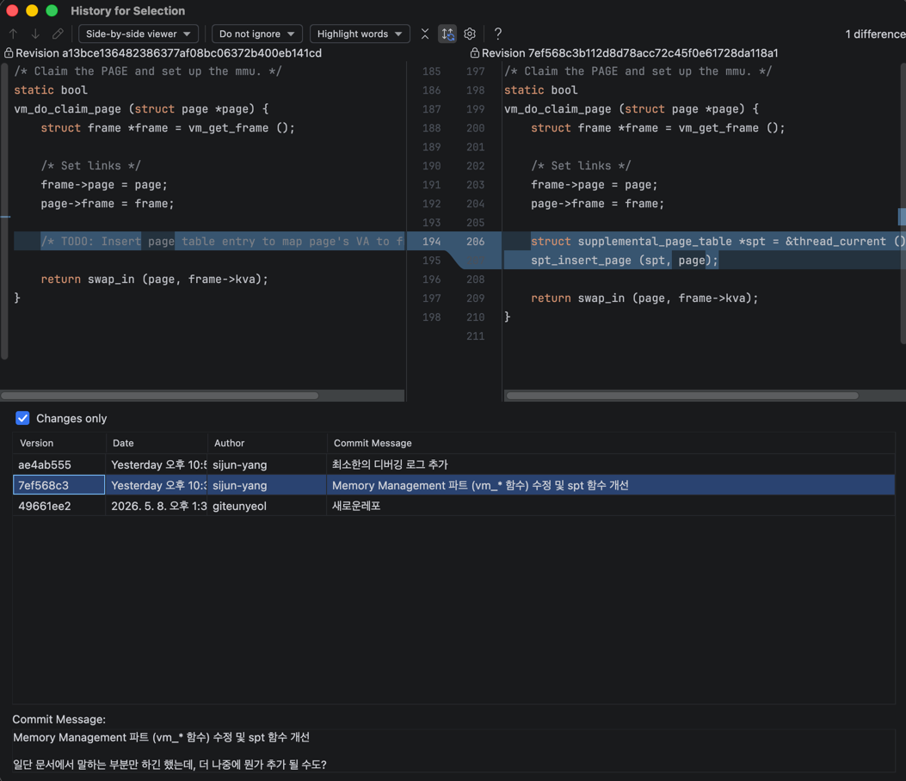

### Anonymous Page 파트 작업하기

#### 핵심 내용 

> 먼저, 커널이 새로운 페이지를 요청받으면 vm_alloc_page_with_initializer 이 호출됩니다.   
> 초기화 프로그램은 해당 페이지의 유형에 따라 적절한 초기화 작업을 수행한 뒤, 제어권을 사용자 프로그램에 다시 반환합니다.

> 사용자 프로그램이 실행되는 도중에, 프로그램이 실제로는 존재하지 않는 페이지에 접근하려고 하면 페이지 오류가 발생합니다.

> 초기화 -> 페이지 오류 발생 -> 지연 로딩 -> 스왑인/스왑아웃 -> … -> 삭제와 같은 라이프사이클을 가집니다.

해야하는 것

vm_alloc_page_with_initializer 으로 신규 페이지 init

페이지 폴트 시 적절한 핸들링?

#### 구현하기

뭐... 딱히 어렵진 않았음. page의 내용이나 그런건 다른 팀 이야기하는거 끼어들어서 주워듣고...

하나보니 vm_alloc_page_with_initializer까지는 그냥 함.

Panic이 많이 필요하던데 그냥 IDE 인덱싱으로 검색해보니까 있더라

DEG_NOTE + ASSERT false 쓰던거 라인 수 좀 줄임

#### 그 외 함수

`uninit_intialize()`, `vm_anon_init()`, `anon_initializer()` 은 수정할 수 있다는데,

당장에는 swap을 고려하지 않기 때문에 냅둬도 될 듯?

#### load_segment 구현하기

이거는 실제로 frame을 가져와야 하는데... `vm_get_frame()` 을 만들었으니까 이걸 쓰면 되려나

(엥 패닉 vm_get_frame에서 이미 썼었네)

근데 스태틱이라, `vm_claim_page()`을 써야 함.

뭔가 너무 기능이 적은거 같은데 이것만으로 괜찮나...

일단 디버그 로그 좀 붙이고 테스트해봐야 할 듯?

생각보다 테스트 가능한 지점이 빨리 도달함.

### 일단 테스트 실행...

분명 에러날거지만 로그 보면서 해결하면 되니까...

vm_alloc_page_with_initializer 에서 의도한 패닉 에러

이미 있는 페이지라는데

뭔가 가정을 잘못했거나... 잘못 구현했거나

근데 이미 있는 페이지일수가 있나? 

-----

파고 올라가다 보니까

ELF64_PHDR의 p_vaddr을 사용하던데?

이게 뭐지 이게 이미 할당된 페이지 영역인가??

일단 이게 뭔지부터 물어보기.

executable file system 포맷인데, 아마 실행파일 페이지 주소를 넘겨준거라

이미 매핑이 되어있는 상태라 find에서 나오고, 이미 할당된 영역에 접근할 수 있었던 듯?

-----

size 찍어보니까 0인거 보니까 해시 잘못 구현한듯?

아 not found 조건을 잘못 찍었네...

확실히 이런건 print 찍는게 좋은 듯?

이거 커밋해두기 나중에 발표자료로 쓸 수 있을듯?


----

보니까 이거 스택 설정을 해야 실행 가능해지는데?

흠... char 배열을 쓰는데 이거까지 넘겨줘야 하나.

아니면 내 코드가 좀 괜찮았는데 그거 쓰게 할까?

아 그냥 메모리 할당하는거네, 바로 세팅까지 하게 하면 되는건가?

project 2 전용이랑 비슷한거같은데

----

이런저런 버그 해결 중

논리 버그도 있고

뭐 중복으로 insert하는 것도 있는데

이거 문제 해결할 때 git history 보고 해결하는게 도움이 많이 됨.

(원래 있는데 내가 지운건지 아닌건지?)

이것도 발표자료로 좋으려나? 혹시 몰라서 캡쳐 후 커밋



---

앵 왜 setup 단계에서 lazy_load_segment가 호출되는거지? 

심지어 상태도 인터럽트 상태가 아닌거 같은데?

아마 USER_STACK 설정이 잘못되었을 수도?

이게 더 작은 값이여야 함. 왜냐면 스택은 커질수록 작아지니까.

stack_bottom을 할당받은게 맞는데? 

swap in을 구현하지 않아서 그런가? 아니면 uninit 상태의 그걸 호출해서 그럴지도?

그러면 상태를 바꿔줘야 하나? 어떻게 할 수 있지? 흠...

vm_get_frame 리턴 이후 에러가 나네?

아마 내 생각에는 pml4랑 연결을 안해서 그런 듯?

이런 내용이 있기는 했음.

> 다시 말해, 페이지 테이블에서 가상 주소와 물리적 주소 간의 매핑을 추가해야 합니다. 반환 값은 작업의 성공 여부를 나타내야 합니다.

확실히 디버깅이 중요하긴 하네...

아니 근데 갑자기 스케줄링 에러가 났는데... 이거 이전 프로젝트 문제인가?

다시 실행하니까 잘?(원래 실패하던데로 실패) 실행됨.

뭔가 지금 확실한게...

vm_do_claim_page이나 vm_get_frame가 잘못 된거 같음.

frame->kva가 0이네 뭔가 잘못되긴 한듯.

일단 여기서 커밋

#### frame 생성 관련 버그 해결하기

palloc 하고 아무것도 없는 상태로 반환하고 있음.

init하는거 추가함.

근데 폴트가 나는데 대체 왤까...

뭘까 대체?

그리고 반환 출력도 안되는데?

(그거 말고 printf 타이밍이 별로거나 너무 많아서 인터럽트 에러나는거 같아서,
자주 보이는거 주석처리함. loop 나 잘 되는거 위주로)

보니까 uninit_initialize 에서 lazy_load_segment를 호출하는데?

아니 근데 이게 맞나? 뭔가 모종의 이유로 호출을 한거 아님?


swap_in 에서 호출하는데 거기서 터지나?

일단 추가함.

그리고 printf도 좀 줄이긴 해야할거 같음. 이거 때문에 중간에 뻗는게 많아서...

아닌데 수정 필요 없다고 했는데 흠...

구현한 팀으로 가서 질문함. 

그 마커 설정 안한거란 with_init 말고 정의된 매크로를 써야함. 왜냐면 굳이 init이 필요 없어서?

with_init은 uninit 상태고, 폴트 나면 처리하는거고

with 없는 버전은 바로 설정하는거임. 아마 직접 연결하는거까지 묶어서 쓰는거 같지만...

근데 정확히는 잘 모르겠네 아직?

깃북에서는 `VM_MARKER_0` 인데 그냥 알아서 특정 의미를 담아서 쓰는건가?

다른 사용 케이스가 없는걸 보면 `VM_MARKER_0`는 스택인거 체크하는 용으로 쓰기로 함.

오 테스트 실행은 됨.

lazy-anon 돌리는 중...

출력은 다 나왔는데 뭐 뽑는게 안되는건가?

이거 다 프린트 해줘야 하나?

테스트하는거 보면 맞는거 같기도 하고? 이거 AI 돌렸거나 그래가지고...

근데 원래 print 찍긴 했던거 생각하면 ㅈ직접 코드 추가해서 하는게 맞는거 같은데?

아 근데 이게 기존 테스트(project 2)가 문제가 없다는거여가지고

지금 돌리는건 project 3 기준인거라 project 2 돌려보면 될 듯?

-----

이거 기존처럼 올 패스함.

```
export PINTOS_ROOT=/workspace/pintos
source "$PINTOS_ROOT/activate"

make -C "$PINTOS_ROOT/userprog" clean
make -C "$PINTOS_ROOT/userprog" check
```

검증용으로 커밋

----

project 2는 printf로 문제 크게 안 생기는거 같은데?

스택 셋업 에러까지 않나는거 보며는?

아니면 할당을 거의 안해서 그럴지도?

아무튼...

