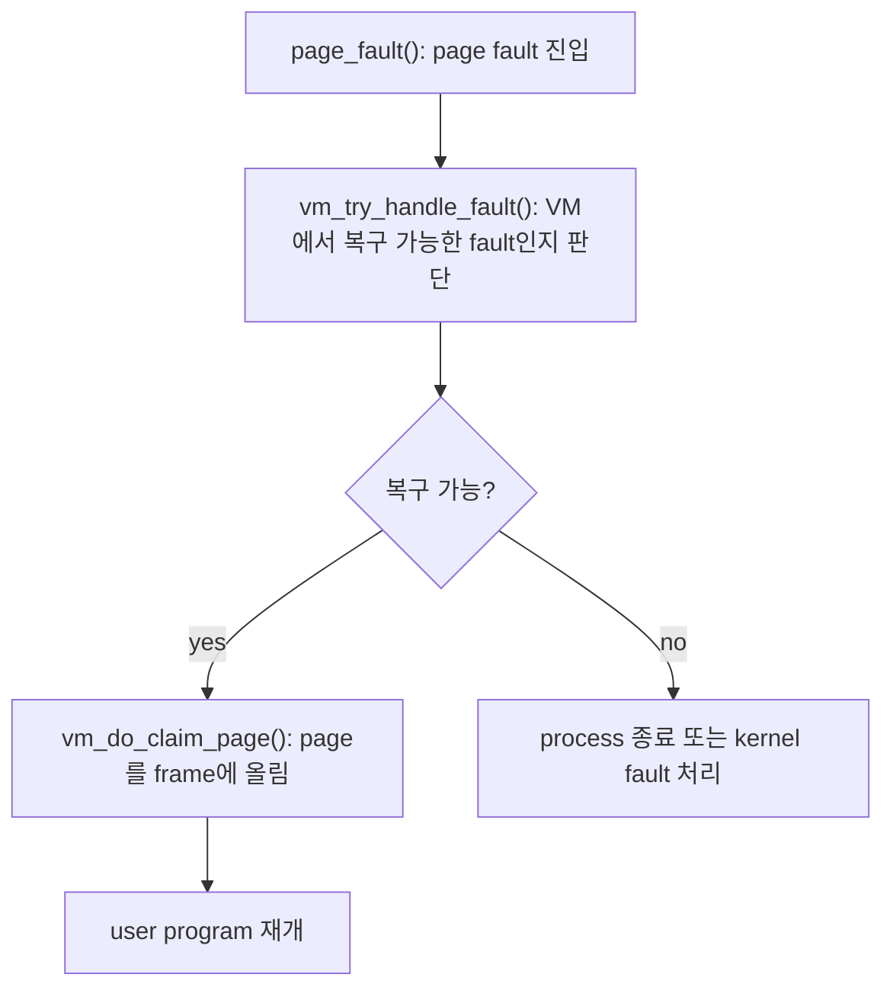
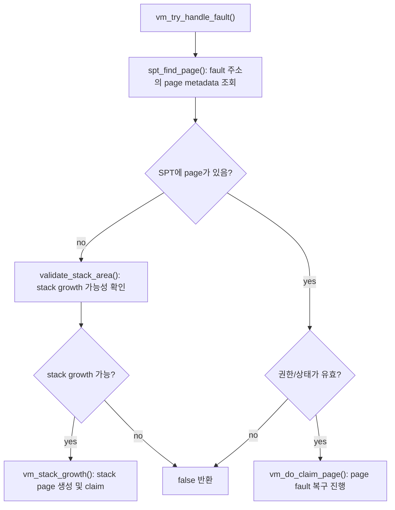
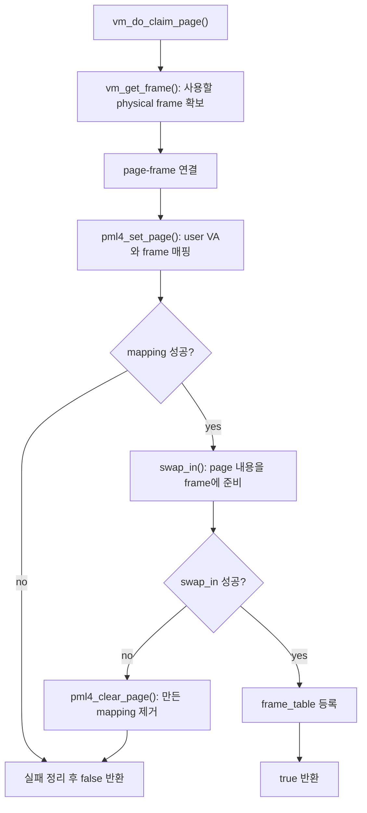
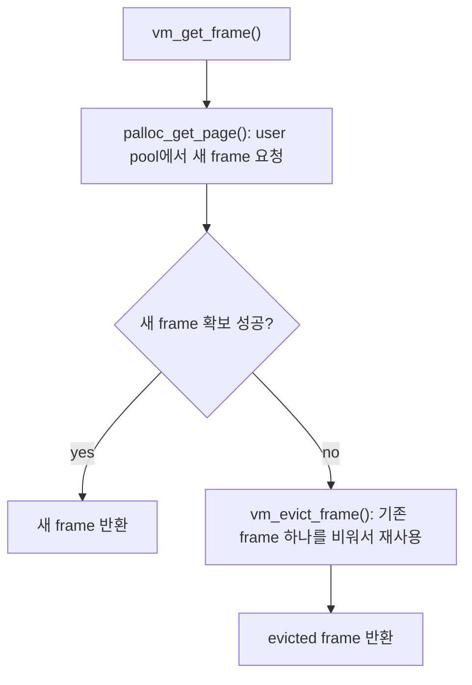
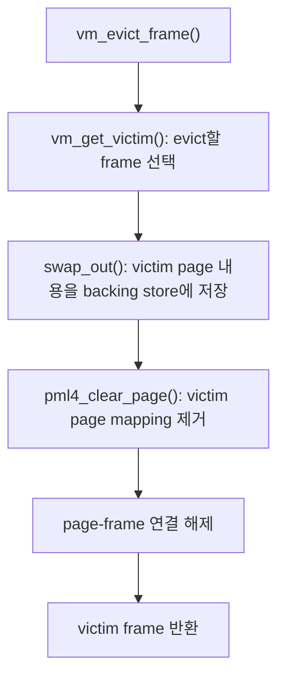
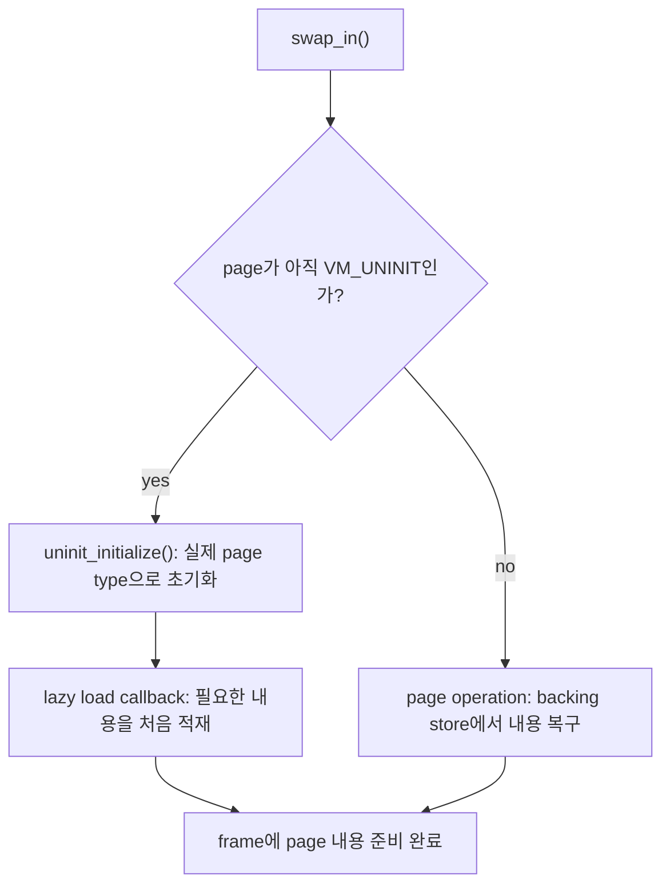
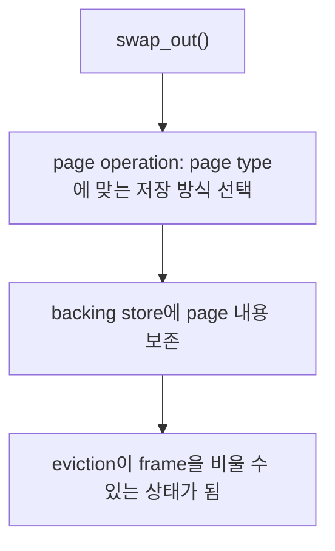
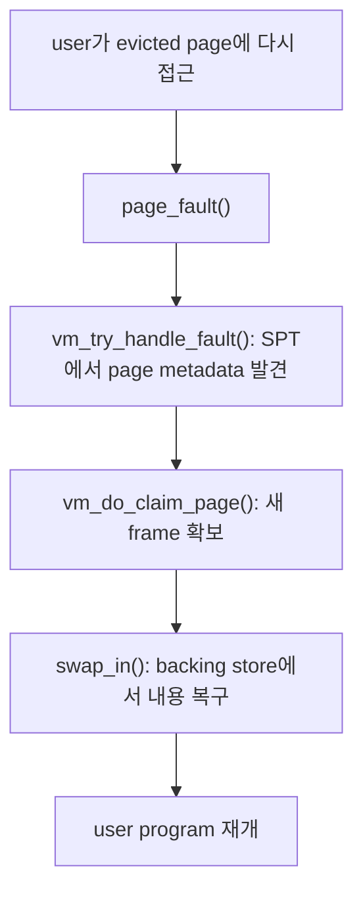
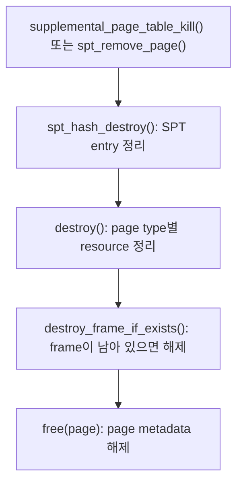

# VM 주차 내용 정리

어제 정리한 page table/pte, spt 역할 부분은 생략하고 나머지 전체적은 흐름 부분

### 페이징이 이루어지는 과정

swap in은 “page 내용을 새 physical frame으로 가져오는 작업”
swap out은 “현재 physical frame에 올라와 있는 page 내용을 다른 page가 쓸 수 있게 비우는 작업”

참고: `docs/ai/035_swap_in_out_구현_흐름.md`

#### 각 함수의 동작

#### 전체 흐름

#### `vm_try_handle_fault()`

#### `vm_do_claim_page()`

#### `vm_get_frame()`

#### frame 부족 시 eviction 흐름

#### `swap_in()`의 큰 의미

`VM_UNINIT`일 때의 `swap_in()`은 이름과 달리 disk swap 복구가 아니다. 첫 fault에서 page를 실제 type으로 바꾸고 lazy loading을 실행하는 흐름이다.

#### `swap_out()`의 큰 의미

타입별 구현체의 세부 동작은 여기서 중요하지 않다. 핵심은 `swap_out()`이 frame을 비우기 전에 page 내용을 잃지 않도록 보존한다는 점이다.

#### 다시 접근할 때의 흐름

#### page destroy 정리 흐름

